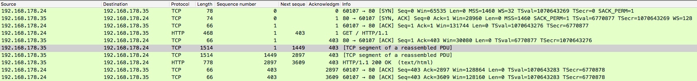

= TCP Protocol Operation
:stats: transport-layer:ldvx49yf,0,134

== Protocol Operation

.TCP connection phases
* ∃ three phases:

.TCP connection phases; Connection establishment
* *active open*, for the client
* *passive open*, for the server

.TCP connection phases; Data transfer
* does not know clients or server, a symmetrical connection

.TCP connection phases; Connection termination
* *active close*, for the client
* *passive close*, for the server

.TCP state diagram
image::http://www4.cs.fau.de/Projects/JX/Projects/TCP/tcpstate.html[TCP State diagram]
* every state in the TCP state diagram is a state where you are waiting for something

== Protocol operation: Connection establishment

.state transition diagram of TCP connection establishment

.CLOSED
* both endpoints start in a CLOSED state
* a closed endpoint can either get:
** *passive open*: transition into LISTEN
** *active open*: send a SYN to another endpoint, transitions into SYN-SENT

.LISTEN
* endpoint assumes part of server
* server binds to and listens at a port to open it up for a connection:
** waits for a connection from any remote TCP port (a SYN)
** transition into SYN-RECEIVED

.SYN-SENT
* endpoint assumes part of client
* after having sent a connection request:
** client waits for a matching connection request
** i.e. a SYN/ACK to transitition into ESTABLISHED
** gets to ESTABLISHED before server

.SYN-RECEIVED
* after having both received and sent a connection request
** server waits for matching connection request acknowledgement
** i.e. an ACK to transitition into ESTABLISHED

.ESTABLISHED
* data transfer phase
* TCP connection is completely symmetrical:
** neither side is distinguishable as server, or client
** both have an open connection
** data received can be delivered to the user

== Protocol operation: Connection establishment: Tree-way handshake

.three-way handshake; SYN
* client sends active open SYN to server:
** seqno is random value `A`, usually zero
** ackno is zero

.three-way handshake; SYN-ACK
* server replies with SYN-ACK in response:
** seqno is random value `B`, usually zero
** ackno is `A+1`

.three-way handshake; ACK
* client sends back ACK
** seqno is `A+1`
** ackno `B+1`

== Protocol operation: Connection establishment: Simultaneous open

.simultaneous open
* happens if both processes send a SYN to each other, before receiving each others ACK
** in this case, both reply with a SYN/ACK
** both are a active open in this case

== Protocol operation: Connection termination

.state transition diagram of TCP connection termination (8)

.ESTABLISHED
* start point for both endpoints
* any of the two can initiate the closing of the connection by sending a FIN packet
** transitions to FIN-WAIT-1

.FIN-WAIT-1
* client waits for an ACK:
** i.e. acknowledgement of connection termination previously sent

.CLOSE-WAIT
* server has received the connection termination request and sends its ACK
** however, the server might not close the connection just yet

.FIN-WAIT-2
* client received the ACK, now it waits for the FIN:
** i.e. connection termination request from server
** server might as well continue sending packets, only means client doesn't send any more

.LAST-ACK
* server finally decided to close the connection:
** sent its own FIN to the termination client

.TIME-WAIT
* client received the matching termination request, and acknowledges it:
** connection for server is completely over at this point (back at CLOSED)
* client closes virtual circuits, and releases allocated ressources
*  it also has a timeout of 2 MSL (maximum segment lifetime) timeout:
** prevents confusion due to delayed packets

.CLOSED
* represents no connection at all

.TCP four-way handshake; possibility of three-way handshake
* connection termination uses a four-way handshake:
** each side terminates independently

* ↯ sometimes, this is joined into a FIN / FIN-ACK / ACK three-way handshake:
** server skips CLOSE-WAIT:
*** transitions directly into LAST-ACK by sending a FIN/ACK packet
** client skips FIN-WAIT-1:
*** transitions directly into TIME_WAIT, by acknowledging this packet
** except for the timeout, the connection is terminated at this point

.TCP simultaneous close
* happens when both initiate an active close before receiving each others ACK
* in this case, both endpoints transition into CLOSING:

.CLOSING
* represents a simultaneous close
** both send another ACK, and
** both have to wait for 2 MSL timeout

== Sequence number analysis

.sequence number analysis; sequence number
* 32-bit, also called *seqno*
* identifies position/count of the first data byte of this segment in stream:
** stream orignated from the sender

.sequence number analysis; next sequence number
* identifies position/count of the last data byte + 1 of this segment in stream:
** equivalently, count of first byte in next segment from this sender
** equivalently, expected acknowledgement number in corresponding ACK

* not in TCP header, but calculated by  `N = N_0 ` n`, where:
.. sequence number, `N_0`
.. TCP data size, excluding all headers (Ethernet, IPv4, TCP), `n`

.sequence number analysis; acknowledgement number
* 32-bit, also called *ackqno*
* identifies position/count of next data byte sender is expecting to receive:
* alternatively, seqno of last successfully received byte of data + 1
** i.e. the next seqno

.sequence number analysis; effect of ACKs on seqno
* ACKs don't raise the sequence number
* not all packets need to be acknowledged:
** just needs to avoid timeouts ∴ avoiding unnecessary traffic

'''

.properties of requested streak of segments; transmission
* if a request segment `(N,m)` from A initiates a sequence of messages from B:
** data messages from B will look like: `(M_i,N)`
** ACKs from A will look like: `(N,M_i)`
** where `M_i` rises with each segment `i`
----
(N_0 , m)    // <-- HTTP GET
(M_1 , N)    // <-- data
(M_2 , N)    // <-- data
(M_3 , N)    // <-- data
(N   , M_2)  // <-- ACK
(N   , M_3)  // <-- ACK
…
(M_n , N)    // <-- data
(N   , M_n)  // <-- ACK
----

.properties of requested streak of segments; transmission; example

