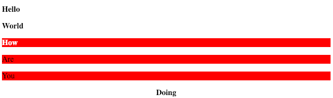

= CSS
:stats: web-development:2ru63urh,0,61

.links
. link::https://developer.mozilla.org/en-US/docs/Web/CSS/CSS_Selectors[]

== CSS selectors

.css selectors; `.class`
* selects by class

.css selectors; `#id`
* selects by id

.css selectors; `*`
* selects every element

.css selectors; `element`

== Combinators

.css selectors; selector lists
* notation: `element,element`
* select both types of elements, e.g.
** `div,p`: select all `div`, and all `p` elements

.css selectors; descendant combinator
* notation: `element element`
* select all elements inside the second element, e.g.
** `div p`: select all `p` elements inside `div` elements

.css selectors; child combinator
* notation: `element>element`
* select all elements where second element is the parent, e.g.
** `div>p`: select all `p` child elements elements inside `div` elements, i.e.
*** no other descendants

.css selectors; general sibling combinator
* notation: `element~element`
* selects all elements that succeed the first element, e.g.
** `p~p`: select all `p`, that succeed another `p` element

.css selectors; adjacent sibling combinator
* notation: `element+element`
* selects all elements that succeed the first element, e.g.
** `p~p`: select all `p`, that succeed another `p` element

'''

.css selectors; overview
----
include::assets/ede3.html[]
----

.css selectors; realization

== Attribute selectors

.css selectors; `[attr]`
* elements with attribute `attr`

.css selectors; `[attr=val]`
* elements with `attr` set exactly to `val`

.css selectors; `[attr|=val]`
* elements with `attr` set exactly to `val`

.css selectors; `[attr~=val]`
* element with a whitespace-separated list of values in `attr`, where
** one of them is `val`

.css selectors; `[attr^=val]`
* elements with `attr` prefixed with `val`

.css selectors; `[attr$=val]`
* elements with `attr` suffixed with `val`

.css selectors; `[attr*=val]`
* elements with `attr` containing `val` at least once

.css selectors; `[attr<operator>val i]`
* operator operators case-insensensitively

== Pseudo-elements

.css selectors; `::after`
.css selectors; `::before`
.css selectors; `::first-letter`
.css selectors; `::first-line`
.css selectors; `::placeholder`
.css selectors; `::selection`

== Pseudo-classes

.css selectors; `:active`
.css selectors; `:first`
.css selectors; `:first-child`
.css selectors; `:optional`
