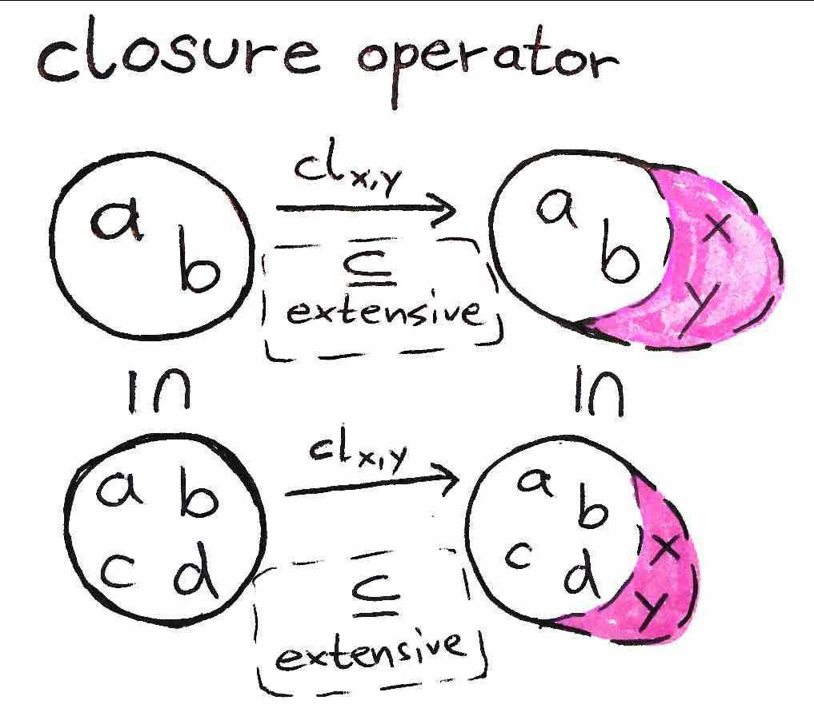
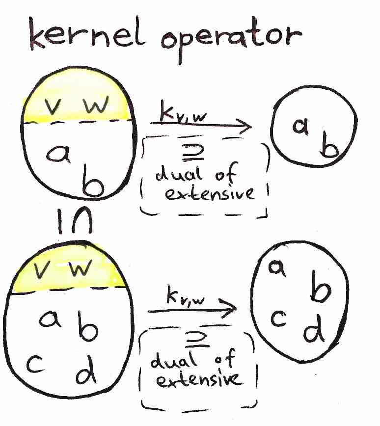

= Monotonic functions and lattice homomorphisms

== Monotonic functions

.monotonic functions
* functions between posets have certain additional properties related to order

.monotonic functions; properties
* a function `f: (P,≤) → (Q,⊑)` is:
.. *order-preserving* or *monotone* iff `a ≤ b ⇒ f(a) ⊑ f(b)`
.. *order-reversing* or *antitone* iff `a ≤ b ⇒ f(a) ⊒ f(b)`
.. *order-reflecting* iff `f(a) ⊑ f(b) ⇒ a ≤ b`

.monotonic functions; *order embeddings*
* both order-preserving, and order-reflecting: `a ≤ b ⇔ f(a) ⊑ f(b)`, e.g.
** successor function, or any function from discrete order
* a monomorphism in `Pos`

.monotonic functions; *order isomorphisms*
* monotone bijective function with monotone inverse
* synonymous with surjective order embedding

== Pointwise-order

.pointwise orders
* a qualifier indicating a property is defined by considering each `f x`:
** order of functions, instead of functions of orders
** e.g. in domain theory (with function spaces)

.pointwise operators
* pointwise orders gives rise to pointwise operators:

----
f, g: X → R
(f + g)(x) = fx + gx -- pointwise addition
(fg)(x) = (fx)(gx)   -- pointwise multiplication
----

== Galois connections

.Galois connections
* weaker than order-isomorphisms
* generalize correspondence between subgroups and subfields in Galois theory

* monotone Galois connections: adjunctions between posets
* antitone Galois connections: dual adjunctions between posets

== Galois connections: Monotone Galois connections

.monotone Galois connections
* given `(A,≤), (B,≤)`, a monotone Galois connection `(F,G)` consists of:
.. pair of monotone functions, `F: A → B, G: B → A`
*** `F` is called *lower/left adjoint*
*** `G` is called *upper/right adjoint*
.. property `Fa ≤ b ⇔ a ≤ Gb`

.Example
----
A = {a₁,a₂,…}, B = {b₁,b₂,…}
F: A → B
F: aᵢ ↦ aᵢ₊₁

G: B → A
G: bᵢ ↦ bᵢ₋₁
----

.properties of monotone Galois connections (2,2)
* one adjoint _uniquely_ determines the other:
.. `Fa` is the least element `b^~`, `a ≤ G(b^~)`
.. `Gb` is the greatest element `a^~`, `F(a^~) ≤ b`

.give rise to:
.. `GF: A → A`:
*** is the associated closure operator
*** in category theory, a *monad*
.. `FG: B → B`:
*** is the associated kernel operator
*** in category theory, a *comonad*

* if one is invertible, the other is the inverse, `F = G⁻¹`

.Example with floor, ceil, and injection map
----
⌊-⌋, ⌈-⌉: ℕ → ℝ
⌊-⌋ x ↦ ⌊x⌋
⌈-⌉ x ↦ ⌈x⌉

ι: ℝ → ℕ
ι x ↦ x

⌊-⌋ ⊣ ι
ι ∘ ⌊-⌋: ℝ → ℝ -- monad
⌊-⌋ ∘ ι: ℕ → ℕ -- comonad

ι ⊣ ⌈-⌉
⌈-⌉ ∘ ι: ℕ → ℕ -- monad
ι ∘ ⌈-⌉: ℝ → ℝ -- comonad
----

floor

== Galois connections: Antitone Galois connections

.antitone Galois connection (2)
* the original defintion of Galois connection:

* given `(A,≤), (B,≤)`, a monotone Galois connection `(F,G)` consists of:
.. pair of antitone functions, `F: A → B, G: B → A`, where:
*** `F` is called *lower/left polarity*
*** `G` is called *upper/right polarity*
.. `b ≤ Fa ⇔ a ≤ Gb`

.properties of antitone Galois connections (2,2)
* one polarity uniquely determines the other:
.. `Fa` is the greatest element `b`, `a ≤ Gb`
.. `Gb` is the least element `a`, `b ≤ Fa`

.give rise to
.. `GF: A → A, FG: B → B` are the associated kernel operators
.. fulfill `∀a,b. a ≤ GFa, b ≤ FGb`
* an antitone is just a monotone Galois connection betwen `A`, and `Bᵒᵖ`

== Closure operators

.closure operator; Moore closures
* closure operator working on sets `S`, i.e.
** `cl: 𝒫 (S) → 𝒫 (S)`, `X,Y ⊆ S`:

.closure operators; translated to posets
* work on sets `S`, i.e. `cl: 𝒫 (S) → 𝒫 (S)`, `X,Y ⊆ S`:
.. *idempotent*: `cl(cl(X)) = cl(X)`
.. *increasing*: `X ⊆ Y ⇒ cl(X) ⊆ cl(Y)`
.. *extensive*: `X ⊆ cl(X)`, or pointwise `id_X ⊆ cl`

.closure operators; illustration

.closure operators; intuition
* takes a subset, and adds specific elements to it, e.g.
.. `cl_(add element s)`, `cl_(add elements s₁,s₂)`

* can be translated to *posets*:
.. `cl: P → P`
.. replacing `⊆` with `≤`

.closure operators; connection between residuated mappings and closure operators (2)
* every Galois connection (residuated mapping) gives rise to a closure operator:
** in fact, every closure operator arises from a Galois connection:
... closure operator `cl: P → A` is the left adjoint
... embedding `emb: A → P` is the right adjoint

.closure operators; closed sets
* map sets to their *closed sets* `cl(X)`:
** smallest set containing `X`
** the *Moore family* is the family of closed sets

.closure operators; closed elements
* *closed elements* are fixpoints of `cl`, i.e. `cl(c) = c`
** `cl` is determined by its closed elements ⇒ `x ≤ c ⇒ cl(x) ≤ c`

== Kernel operators

.kernel operators
* work on sets `S`, i.e. `k: 𝒫 (S) → 𝒫 (S)`, `X,Y ⊆ S`:
* dual to the closure operator, an operator `k`
* fulfills increasing and idempotent properties, but dual to extensiveness:
.. *idempotent*: `k(k(X)) = k(X)`
.. *increasing*: `X ⊆ Y ⇒ k(X) ⊆ k(Y)`
.. *dual of extensive*: `k(X) ⊆ X`, or pointwise `k ⊆ id_P`

.intuition
* cut elements from a set

.kernel operators; illustration

== Sublattices and quotient lattices

.sublattice; convex sublattice (2;1)
* fulfills properies
.. nonempty, subset of a lattice, `S ⊆ L`
.. lattice with same meet and join operations:
*** i.e. `∀a,b ∈ S. (a ∧ b ∈ S) ∧ (a ∨ b ∈ S)`

* a sublattice is *convex*, iff `∀x,y,z ∈ L. (x ≤ z ≤ y) ∧ (x,y ∈ S) ⇒ z ∈ S`

TODO can't find material
Quotient lattices::

