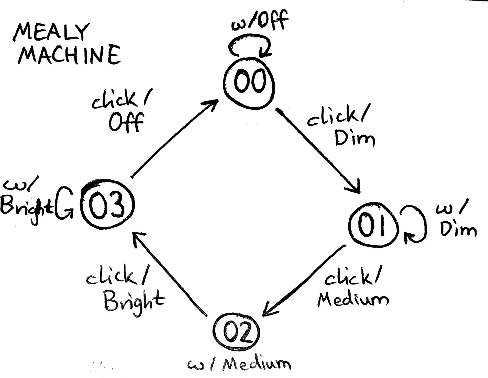

= Moore, and Mealy machines

== State machines

.state machines; definition
* starting with the *initial state* and a list of arbitrary inputs
* you traverse the states until you end at some final state
* along the way you _collect outputs_

== Moore machine

.moore machine; definition
* defined as sixtuple `(S,S₀,Σ,Λ, T,G)`:
.. states `S`, with initial state `S₀ ∈ S`
.. input alphabet `Σ`
.. output alphabet `Λ`
.. transition function `T: S×Σ → S`
.. output function `G: S → Λ`

:1549905666407:
.moore machine; contained sets
. *states* S, a finite set, with the *initial state* `S₀∈S`
. *input alphabet* `Σ`, a finite set
. *output alphabet* `Λ`, a finite set

:1549905764563:
.moore machine; contained functions
. a *transition function* `T: S×Σ → S`:
** maps state and input to next state
** in a graph, all edges combined represent this function
** basically that given `n` inputs any state has `n` edges from it to some state
. an *output function* `G: S → Λ`:
** maps state to output
** i.e. each state is associated with an output value

== Mealy machine

.mealy machine; definition
* defined as sixtuple `(S,S₀,Σ,Λ, T,G)`, alternatively:
** a *Moore machine* with a different output function:
.. states `S`, with initial state `S₀ ∈ S`
.. input alphabet `Σ`
.. output alphabet `Λ`
.. transition function `T: S×Σ → S`
.. output function `G: S×Σ → Λ`

:1549905857126:
.mealy machine; output function
. an *output function* `G: S×Σ → Λ`:
** maps state and edge to output
** i.e. each edge is associated with an output value

== Dimmer example

.dimmer example; sets
----
S = {00,01,02,03}
Σ = {ω , click}
Λ = {Off, Dim, Medium, Bright}
----

:ext:1549905764563:
.dimmer example; moore machine illustration
image::assets/mooremachine.jpg[Simple Moore machine]

:ext:1549905857126:
.dimmer example; mealy machine illustration

== Differences between Moore and Mealy machines

.differences
.. Mealy machines tend to have fewer states
.. Moore machines are safer to use
.. Mealy machines react faster to inputs

.differences; more
* any Mealy machine, where any edge with the same codomain yields the same result can
  easily be turned into Moore machine
* the reverse is not true
* however they are still *isomorphic* (with state monad as well)
