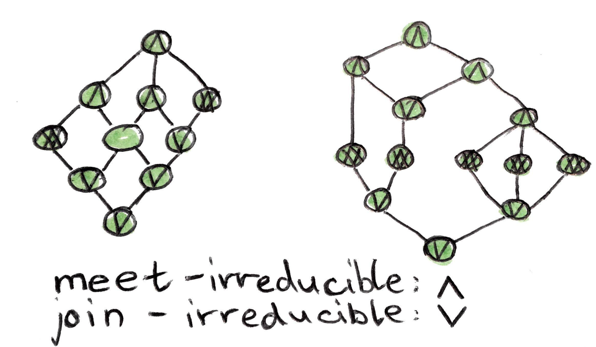
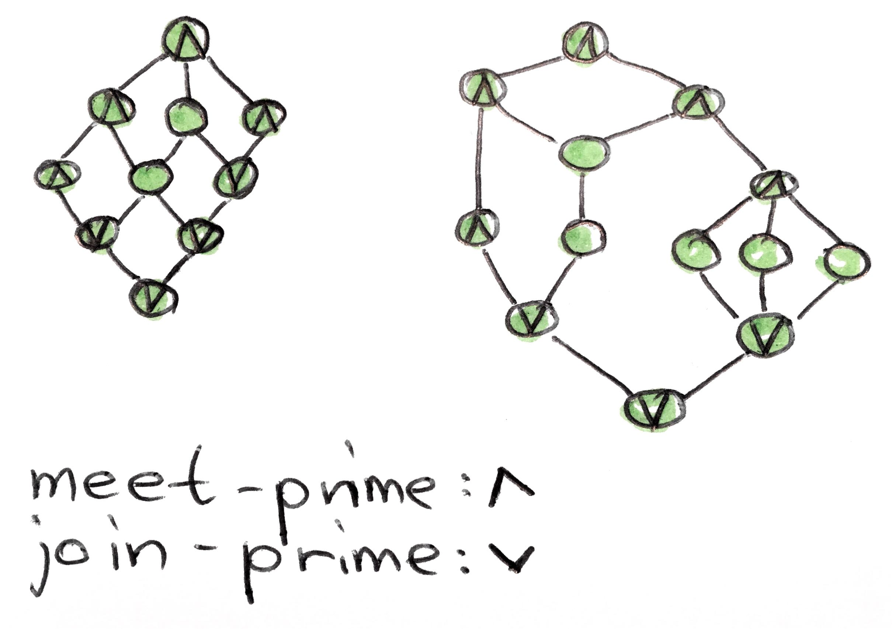

= Irreducible and prime elements

== Irreducible elements

:1547315699838:
.irreducible elements; *meet-irreducible* element
* an element `l∈L`, iff
..`∀x,y. x∧y = l ⇒ (x = l) ∨ (y = l)`, i.e.
*** not replacable by a meet of two other distinct elements
*** covered by at most one element

:1547315786375:
.irreducibible elements; *join-irreducible* element
* an element `g∈L`, iff
.. `∀x,y. x∨y = g ⇒ (x = g) ∨ (y = g)`, i.e.
*** not replacable by a join of two other distinct elements
*** covers at most one element

:ext:1547315699838:
:ext:1547315786375:
.irreducibible elements; illustration

'''

.irreducible elements; doubly-irreducible element
* an element both meet-reducible, and join-irreducible

.irreducible elements; completely irreducible
* completely join-irreducible, iff generizable to joins of arbitrary size
* completely meet-irreducible, iff generizable to meets of arbitrary size

== Prime elements

:1547315884227:
.prime elements; *meet-prime element*
* an element `l∈L`, iff
.. `∀x,y. x ∧ y ≤ l ⇒ (x ≤ l) ∨ (y ≤ l)`, i.e.
*** meet-irreducible, and you cannot precede `l` with incomparable elements

:1547315929363:
.prime elements; *join-prime element*
* an element `g∈L`, iff
.. `∀x,y. x ∨ y ≥ g ⇒ (x ≥ g) ∨ (y ≥ g)`, i.e.
*** join-irreducible, and you cannot suceed `g` with incomparable elements

:ext:1547315884227:
:ext:1547315929363:
.prime elements; illustration

'''

.prime elements; doubly-prime element
* an element both meet-prime, and join-prime

.prime elements; completely prime
* called completely meet-prime, iff generizable to meets of arbitrary size
* called completely join-prime, iff generizable to joins of arbitrary size

