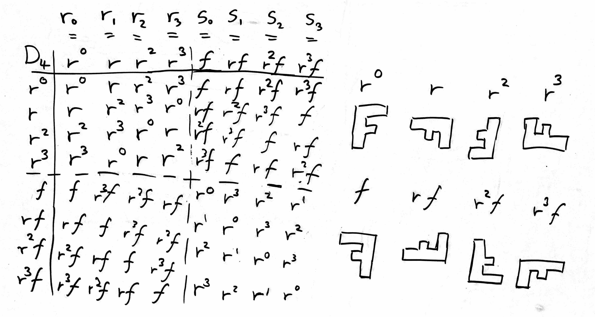

= Isometry groups

== Isometry groups

.isometry
* a distance-preserving transformation between *metric spaces*
** i.e. it is *bijective*, but not necessarily *endomorph*
** identity element is the identity function

.isometry group
* set of all *isometries* with function composition as the group operation
* every isometry group of a metric space is a _subgroup of isometries_
** mostly _represent_ possible *symmetries* in the space
** ∵ need to have inverses (you can't inverse non-bijective morphisms)

== Symmetries

* a symmetry is a bijective endofunction
** i.e. automorphism
* we want to preserve some structure (isometries, i.e. distance)

== Symmetry groups

* like permutation groups for isometry groups
* _subgroup of the isometry group_, for any space with a metric:
** normally we look at Euclidean space
* group of all transformations under which the object is *invariant*
** i.e. looking at group structure, doesn't tell if an isometry group is a symmetry group
** you have to look at the object itself
** i.e. it is only interesting definition-wise
* composition is the group operator

full symmetry group::
* a term used to emphasize, that it includes orientation-reversing isometries
** e.g. reflections, glide reflections, improper rotations, etc.

proper symmetry group::
* subgroup of a the full symmetry group, that leave the figure invariant
* the proper symmetry group is equal to its full symmetry group, iff the object is *chiral*

.Examples
* isometry group of n-dimensional Euclidean space is the *Euclidean group* E(n)
* isometry group of Minkowski space is the *Poincaré group*
* isometry group of Riemannian symmetric space is the *Lie group*

.In 1D

.In 3D

== Point groups in 2D

.point groups in 2D
* discrete point groups in 2D space are:
.. *cyclic groups* `Zₙ`:
*** all rotations about a fixed point by multiples `2π/n`
.. *dihedral groups* `Dih₂ₙ`
*** all rotations of `Zₙ` + reflection `a`

== Point groups in 2D: Cyclic group

.Definition
* a *cyclic group* is a group generated with a single element, called its *generator*
* alternatively, `G` is called cyclic, if there exists an element such that:
** `G = ⟨⟨g⟩⟩ = {g^n | n ∈ ℤ }`
** alternatively, the only subgroup of `G` that contains `g` is `G` itself

.cyclic groups; categorization
.  *infinite cyclic groups*:
** isomorphic to the additive group `ℤ`
. *finite cyclic groups*:
** isomorphic to the additive group `ℤ/nℤ`

* *subgroups* and *quotient groups* of cyclic groups are cyclic
* also every cyclic group is *abelian*
* *cyclic* as a term can be misleading:
** think of having _one infinitely long cycle_

----
Z = ℤ = <1> = {..., 1^(-2), 1^(-1), e, 1, 1^(2), ...}
C₅ = Z₅= ℤ/5ℤ = {0, 1, 2, 3, 4}
----

== Point groups in 2D: Cyclic group: Operations

.cyclic group operation; modular addition
* a subgroup of the the set of integers under addition
* the generators are `1`, or `-1`
* notation is `Z/(n)`
** however the only valid generators are 1, -1
** all cyclic groups under modular addition are isomorphic to the infinite group

__image__

.cyclic group operation; modular multiplication
* subset of integers modulo `n`, that are *coprime* to `n`
* called "group under multiplication modulo n"
* is cyclic if n is 1, 2, 4, a power of an odd prime, or twice a power of an odd prime
* a group `(Z/nZ)^xx`

* e.g.
** `(Z/6Z)^xx = {1, 5}` is cyclic (`1*1 = 1, 1*5 = 5, 5*5 = 25 mod 6 = 1`
** `(Z/8Z)^xx = {1, 3, 5, 7}` is not cyclic

__image__

.cyclic group operations; rotational symmetries
* set of rotational symmetries of a polygon form a finite cyclic group
* this makes the elements of the group rotations, and the group operator is composition

.Example of `C_5`
image::https://en.wikipedia.org/wiki/Cyclic_group#/media/File:Flag_of_Hong_Kong.svg[Hong Kong flag]

== Point groups in 2D: Dihedral groups

* group of symmetries of a regular polygon, which includes:
.. *rotations*
.. *reflections*

* in geometry, `D_n` refers to the symmetries of the n-gon
* in abstract algebra, `D_n` refers to the dihedral group of order 2n

.Definition
* a regular polygon with n sides has `2n` different symmetries:
.. n rotational symmetries
.. n reflection symmetries
* the associated symmetries make up the Dihedral group `n`

* there are `n` axes of symmetry and the order is `2n`
* alternatively, if `n` is even, there are `n/2` axes of symmetry connecting the midpoints of
  opposite sides

----
r_i r_j = r_(i+j)
r_i s_j = s_(i+j)
s_i r_j = s_(i-j)
s_i s_j = r_(i-j)
----

.Examples
* `D_4` is the dihedral group resulting of the symmetries of the letter "F"

=== Matrix groups
